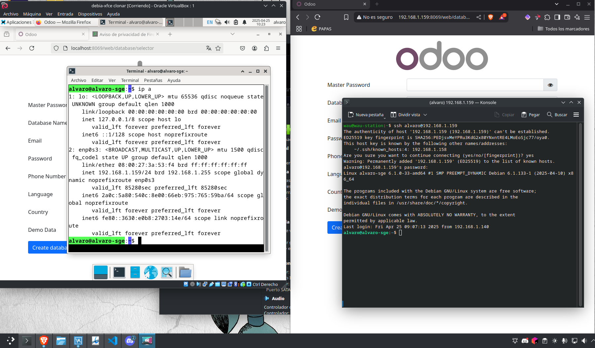
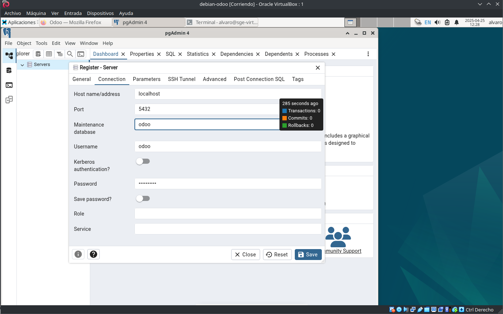
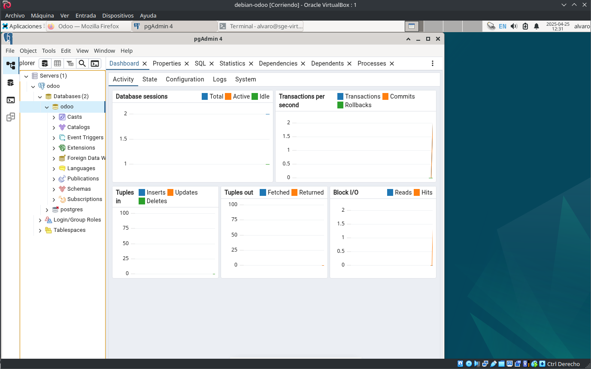

# Instalación de Odoo en Debian (VirtualBox)

## 1. Instalación normal de Debian
En mi caso uso debian-xfce

## 2. Actualización del sistema
Ejecutamos los siguientes comandos para actualizar el sistema:
```bash
sudo apt update && sudo apt upgrade -y
```

## 3. Instalación de SSH
Instalamos el servidor SSH:
```bash
sudo apt install openssh-server -y
```
Verificamos el estado del servicio y lo activamos para que inicie automáticamente:
```bash
sudo systemctl status ssh
sudo systemctl start ssh
sudo systemctl enable ssh
sudo systemctl status ssh
```
Apagamos el sistema:
```bash
sudo shutdown now
```

## 4. Configuración de red en VirtualBox
Configuramos los adaptadores de red:
- **Adaptador 1:** "Adaptador puente"

Reiniciamos el sistema y verificamos la IP asignada:
```bash
ip a
```
Anotamos la IP asignada (por ejemplo, `192.168.1.171`).

## 5. Conexión desde Windows
Desde la terminal de Windows, nos conectamos al servidor SSH:
```bash
ssh alvaro@192.168.1.171
```

## 6. Instalación de dependencias
Ejecutamos el siguiente comando para instalar todas las dependencias necesarias:
```bash
sudo apt update && sudo apt install -y python3-pip build-essential wget git python3-dev libxml2-dev libxslt1-dev libevent-dev libjpeg-dev libpq-dev libz-dev curl fonts-dejavu libldap2-dev libsasl2-dev libtiff5-dev libwebp-dev libopenjp2-7-dev libyaml-dev xz-utils libblas-dev libatlas-base-dev python3-venv
```

## 7. Configuración de SSH
Editamos el archivo de configuración de SSH:
```bash
sudo nano /etc/ssh/sshd_config
```
Descomentamos y modificamos las siguientes líneas:
```
ListenAddress 0.0.0.0
PermitRootLogin prohibit-password
PasswordAuthentication yes
```
Reiniciamos el servicio:
```bash
sudo /etc/init.d/ssh restart
/etc/init.d/ssh status
```
Reiniciamos Debian:
```bash
sudo reboot -f
```

## 8. Creación del usuario "odoo"
Creamos el usuario "odoo" con su directorio:
```bash
sudo adduser --home=/opt/odoo odoo
```

## 9. Instalación de PostgreSQL
Instalamos PostgreSQL y verificamos su estado:
```bash
sudo apt install -y postgresql postgresql-contrib
sudo systemctl status postgresql
```
Creamos el usuario en PostgreSQL:
```bash
sudo -u postgres createuser odoo -U postgres -dP
```
Detenemos PostgreSQL temporalmente:
```bash
sudo systemctl stop postgresql
```
Editamos el archivo `pg_hba.conf`:
```bash
sudo nano /etc/postgresql/15/main/pg_hba.conf
```
Añadimos: en Ipv6
```
host    all             all             0.0.0.0/0               md5
```
Editamos el archivo `postgresql.conf`:
```bash
sudo nano /etc/postgresql/15/main/postgresql.conf
```
Modificamos:
```
listen_addresses = '*'
```
Reiniciamos PostgreSQL:
```bash
sudo systemctl enable postgresql
sudo systemctl start postgresql
sudo systemctl status postgresql
```

Si hasta aquí ha salido todo bien, lo mejor es hacer una clonación de la máquina.

## 10. Instalación de Odoo
Cambiamos al usuario "odoo":
```bash
su - odoo
```
Descargamos el código fuente de Odoo:
```bash
git clone https://github.com/odoo/odoo --depth 1 --branch 17.0 odoo
```
Entramos en la carpeta descargada:
```bash
cd odoo
```
Creamos y activamos un entorno virtual:
```bash
python3 -m venv .odoo-env
source .odoo-env/bin/activate
```
Actualizamos paquetes de Python e instalamos dependencias:
```bash
pip3 install wheel setuptools pip --upgrade
pip3 install -r requirements.txt
```
Creamos el directorio para módulos personalizados:
```bash
mkdir /opt/odoo/odoo/custom-addons
deactivate
exit
```

## 11. Configuración de Odoo
Copiamos y editamos la configuración predeterminada:
```bash
sudo cp /opt/odoo/odoo/debian/odoo.conf /etc/odoo-server.conf
sudo nano /etc/odoo-server.conf
```
Dejamos el archivo así (asegurarnos de cambiar las password {}):
```
[options]
; This is the password that allows database operations:
admin_passwd = {user_odoo_password}
db_host = localhost
db_port = False
db_user = odoo
db_password = {user_odoo_postgresql}
addons_path = /opt/odoo/odoo/addons,/opt/odoo/odoo/custom-addons
default_productivity_apps = True
xmlrpc_port = 8069
```
Creamos y configuramos el archivo de servicio:
```bash
sudo nano /etc/systemd/system/odoo.service
```
Contenido: cambiar lo que está entre {}:
```
[Unit]
Description=Odoo
Requires=postgresql.service
After=network.target postgresql.service
[Service]
Type=simple
SyslogIdentifier=odoo
PermissionsStartOnly=true
User=odoo
Group=odoo
ExecStart=/opt/odoo/odoo/.odoo-env/bin/python3 /opt/odoo/odoo/odoo-bin -c /etc/odoo-server.conf
StandardError=journal
Restart=always
StandardOutput=journal+console
[Install]
WantedBy=multi-user.target
```
Recargamos y activamos el servicio:
```bash
sudo systemctl daemon-reload
sudo systemctl enable --now odoo
sudo systemctl status odoo
```

Si esto nos diese error, lo que tenemos que hacer es entrar, aunque no debería, ya que está modificado más arriba:
```bash
sudo -i
sudo chmod +x /opt/odoo/odoo/.odoo-env/bin/python3
source /opt/odoo/odoo/.odoo-env/bin/python3
pip install -r /opt/odoo/odoo/requirements.txt
```

## 12. Instalación de Nginx
Instalamos Nginx y configuramos un archivo para Odoo:
```bash
sudo apt install nginx
sudo nano /etc/nginx/conf.d/odoo.conf
```
Contenido:
```nginx
upstream odoo {
    server 127.0.0.1:8069;
}

upstream odoochat {
    server 127.0.0.1:8072;
}

server {
    listen 80;
    server_name localhost;

    # Configuración de logs
    access_log /var/log/nginx/odoo.access.log;
    error_log /var/log/nginx/odoo.error.log;

    # Configuración de buffers
    proxy_buffers 16 64k;
    proxy_buffer_size 128k;

    # Manejo de la ubicación principal
    location / {
        proxy_pass http://odoo;
        proxy_next_upstream error timeout invalid_header http_500 http_502 http_503 http_504;
        proxy_redirect off;
        proxy_set_header Host $host;
        proxy_set_header X-Real-IP $remote_addr;
        proxy_set_header X-Forwarded-For $proxy_add_x_forwarded_for;
        proxy_set_header X-Forwarded-Proto http;
    }

    # Manejo de longpolling (para chat)
    location /longpolling {
        proxy_pass http://odoochat;
    }

    # Configuración de caché para archivos estáticos
    location ~* /web/static/ {
        proxy_cache_valid 200 60m;
        proxy_buffering on;
        expires 864000;
        proxy_pass http://odoo;
    }
}
```
Activamos Nginx:
```bash
sudo systemctl enable nginx
sudo systemctl restart nginx
sudo systemctl status nginx
```
Verificamos puertos:
```bash
sudo ss -tulnp | grep 8069
```
Creamos logs:
```bash
sudo touch /var/log/nginx/odoo.access.log /var/log/nginx/odoo.error.log
sudo chown www-data:www-data /var/log/nginx/odoo.access.log /var/log/nginx/odoo.error.log
sudo systemctl restart nginx
```

## 13. Acceso desde navegador
Desde Windows, abrimos en el navegador:
```
http://{nuestra_ip}:8069
```

Aquí podemos ver que estamos conectados:



## para instalar pgAdmin


```bash
curl -fsS https://www.pgadmin.org/static/packages_pgadmin_org.pub | sudo gpg --dearmor -o /usr/share/keyrings/packages-pgadmin-org.gpg

sudo apt install lsb-release

sudo sh -c 'echo "deb [signed-by=/usr/share/keyrings/packages-pgadmin-org.gpg] https://ftp.postgresql.org/pub/pgadmin/pgadmin4/apt/$(lsb_release -cs) pgadmin4 main" > /etc/apt/sources.list.d/pgadmin4.list && apt update'

sudo apt install pgadmin4-desktop

```
por el uso de nginx no se recomienda el uso de pgadmin web, ya que abria que configurarlo manualmente, ya que viene preparado para el uso con Apache




